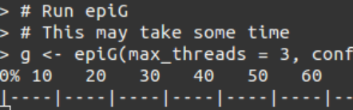
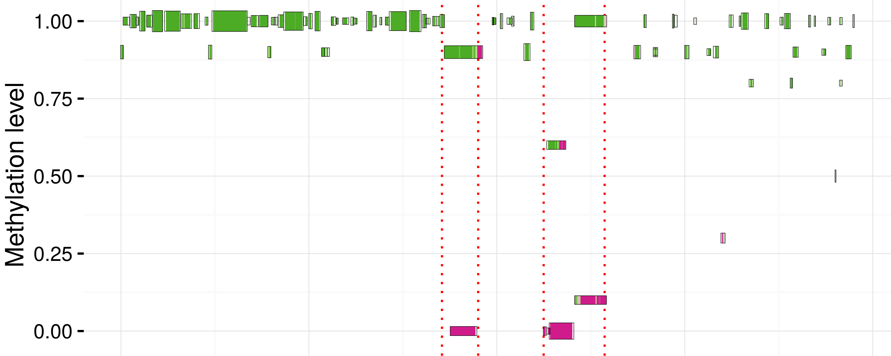
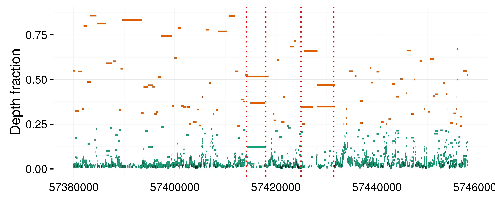
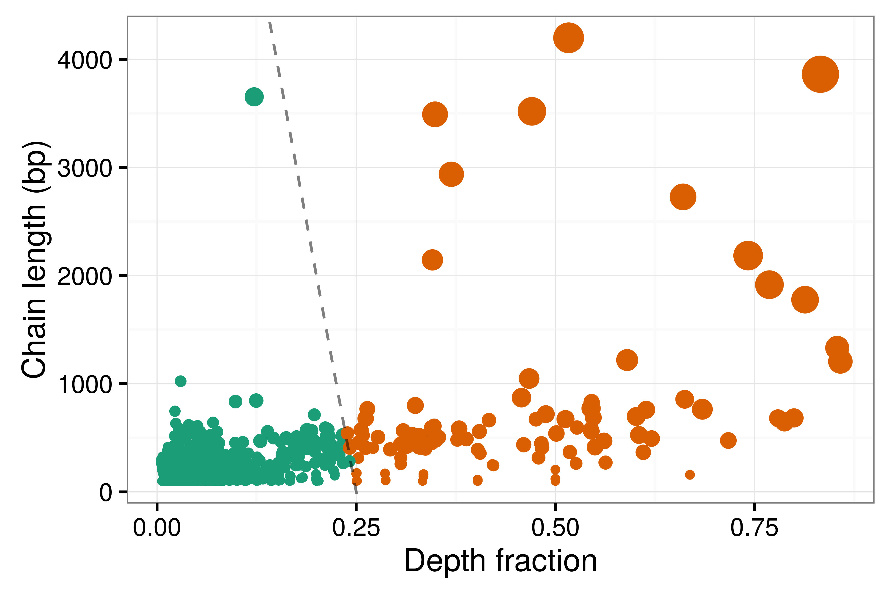

# Using epiG

## Running epiG
[Script: 1-fit.R](1-fit.R)

## Methylation & Epi-allelic Profiling

[Script: 2-methylation-profiling.R](2-methylation-profiling.R)

## Inferred Haplotype Chains

[Script: 3-haplotype-chains.R](3-haplotype-chains.R)

## Clustered Reads

[Script: 4-clustered-reads.R](4-clustered-reads)

## Depth Fraction & Length of Haplotype Chains

[Script: 5-depth-length-plot.R](5-depth-length-plot.R)

